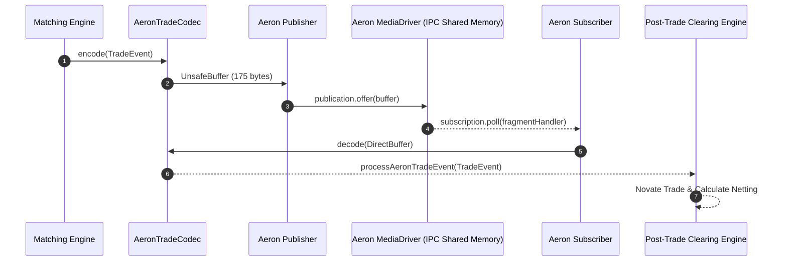
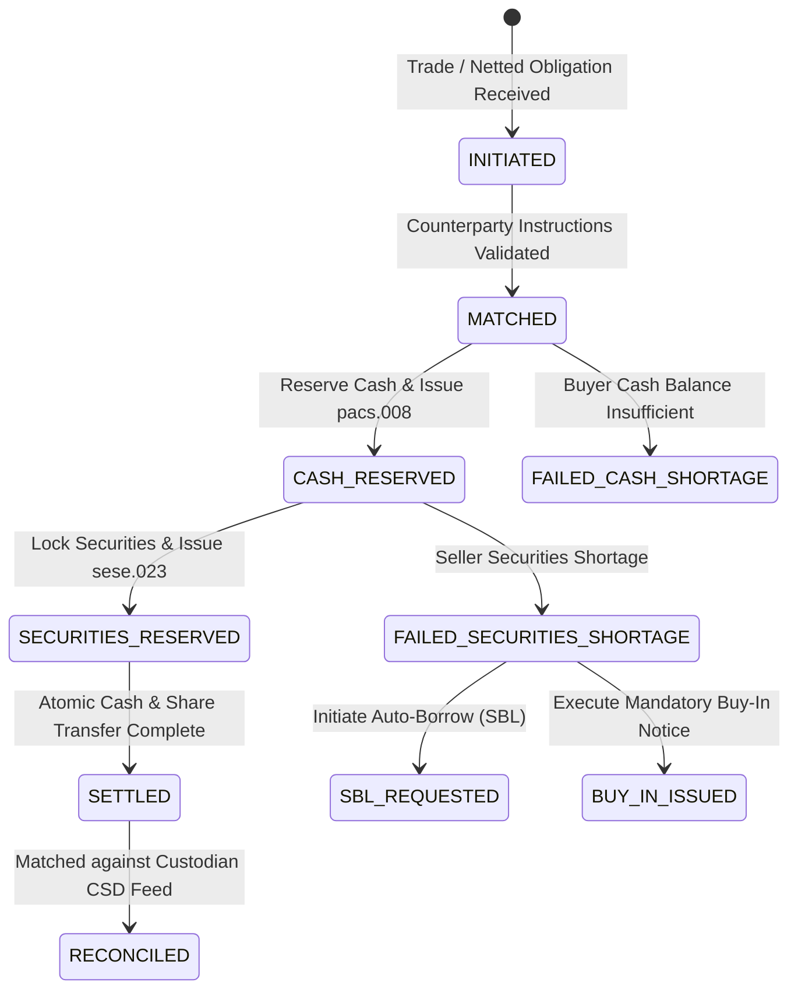

# Nexus Trade: Securities Post-Trade, Clearing & Settlement, and Equities Engine

nexus-trade is an enterprise-grade financial market infrastructure (FMI) platform supporting high-frequency trade execution, Central Counterparty (CCP) clearing, institutional block trade allocation, Delivery versus Payment (DvP) settlement, corporate actions, and custodian reconciliation.

---

## Architectural Deep Dive: Does nexus-trade use Aeron?

> [!IMPORTANT]
> **YES! nexus-trade utilizes Aeron for ultra-low latency IPC/UDP messaging.**
> 
> While Aeron was declared in `pom.xml` (`io.aeron:aeron-client` & `io.aeron:aeron-driver` v1.46.7), nexus-trade implements a dedicated **Aeron Zero-Copy Binary Transport Layer** (`AeronTradeCodec`, `AeronTradeStreamPublisher`, `AeronTradeStreamSubscriber`) to stream executed equity trades directly from high-frequency matching engines into the post-trade clearing pipeline at sub-microsecond latency.

### Aeron Stream Configuration:
- **Channel**: `aeron:ipc` (inter-process communication on shared memory) or `aeron:udp` (network socket streaming).
- **Stream ID**: `1001` (Default Equity Trade Execution Stream).
- **Encoding**: 175-byte zero-copy `DirectBuffer` binary layout avoiding JVM garbage collection pauses.

---

## End-to-End Equity Trade Lifecycle Diagram

The following Mermaid diagram details the complete flow from order execution to CSD custodian settlement:

```mermaid
flowchart TD
    subgraph Execution & Ingestion
        ME["Matching Engine / FIX / OUCH"] -->|1. Execution Report| AeronPub["Aeron Publisher (aeron:ipc)"]
        AeronPub -->|2. Sub-Microsecond Binary Stream| AeronSub["Aeron Subscriber"]
        AeronSub -->|3. Capture Trade (T+1 / T+2)| Capture["Equity Trade Capture Service"]
    end

    subgraph Institutional Allocation
        Capture -->|4. Institutional Block Execution| BlockEngine["Block Trade Allocation Engine"]
        BlockEngine -->|5. Pro-Rata Sub-Account Split| FundAccounts["Fund Accounts A, B, C"]
    end

    subgraph CCP Clearing & Netting
        FundAccounts -->|6. Novation| CCP["CCP Clearing Engine"]
        CCP -->|7. Central Counterparty Novation| ClearedTrades["Cleared Trades Batch"]
        ClearedTrades -->|8. Multilateral Netting| Netting["Multilateral Netting Calculator"]
        Netting -->|9. Net Share & Net Cash Obligations| Obligations["Netted Obligations"]
    end

    subgraph DvP Settlement State Machine
        Obligations -->|10. Initiate DvP| DvPEngine["DvP Settlement Engine"]
        DvPEngine -->|11. Lock Cash (pacs.008)| CashLedger["Cash Ledger"]
        DvPEngine -->|12. Lock Securities (sese.023)| SecLedger["Securities Ledger"]
        CashLedger & SecLedger -->|13. Atomic Transfer| Settled["Settlement SETTLED"]
    end

    subgraph Fail Management & Reconciliation
        DvPEngine -->|Shortage Fail| BuyIn["Fail Management & Buy-In Engine"]
        Settled -->|14. CSD Feed Matching| Recon["Custodian Reconciliation Engine"]
        Recon -->|15. Audit Discrepancies| Reports["Reconciliation Reports"]
    end
```

---

## Aeron IPC Zero-Copy Streaming Architecture



---

## DvP Settlement State Machine Diagram



---

## Core Components Overview

| Component | Class / Package | Description |
| :--- | :--- | :--- |
| **Aeron Ingestion** | [`AeronTradeCodec`](file:///Users/nishi/Documents/GitHub/nexus-trade/src/main/java/com/trading/settlement/aeron/AeronTradeCodec.java), [`AeronTradeStreamPublisher`](file:///Users/nishi/Documents/GitHub/nexus-trade/src/main/java/com/trading/settlement/aeron/AeronTradeStreamPublisher.java), [`AeronTradeStreamSubscriber`](file:///Users/nishi/Documents/GitHub/nexus-trade/src/main/java/com/trading/settlement/aeron/AeronTradeStreamSubscriber.java) | Zero-copy Aeron binary serialization & IPC/UDP streaming. |
| **Trade Capture & Allocation** | [`EquityTradeCaptureService`](file:///Users/nishi/Documents/GitHub/nexus-trade/src/main/java/com/trading/settlement/allocation/EquityTradeCaptureService.java), [`BlockTradeAllocationEngine`](file:///Users/nishi/Documents/GitHub/nexus-trade/src/main/java/com/trading/settlement/allocation/BlockTradeAllocationEngine.java) | T+1/T+2 settlement cycle calculation & institutional block trade splitting. |
| **CCP Clearing & Netting** | [`CcpClearingEngine`](file:///Users/nishi/Documents/GitHub/nexus-trade/src/main/java/com/trading/settlement/clearing/CcpClearingEngine.java) | Novation, Multilateral Netting of equity shares & cash, Initial/Variation Margin calculations. |
| **DvP Settlement** | [`DvpSettlementEngine`](file:///Users/nishi/Documents/GitHub/nexus-trade/src/main/java/com/trading/settlement/dvp/DvpSettlementEngine.java), [`Iso20022MessageFactory`](file:///Users/nishi/Documents/GitHub/nexus-trade/src/main/java/com/trading/settlement/dvp/Iso20022MessageFactory.java) | DvP Models 1/2/3, cash/securities lock state machine, ISO 20022 `pacs.008` & `sese.023` XML generation. |
| **Fail Management & Corporate Actions** | [`CorporateActionAdjuster`](file:///Users/nishi/Documents/GitHub/nexus-trade/src/main/java/com/trading/settlement/equities/CorporateActionAdjuster.java), [`EquityFailManagementEngine`](file:///Users/nishi/Documents/GitHub/nexus-trade/src/main/java/com/trading/settlement/equities/EquityFailManagementEngine.java) | Stock split adjustments (e.g. 2:1), dividend claims, Securities Borrowing (SBL), and Buy-In notices. |
| **Custodian Reconciliation** | [`CustodianReconciliationService`](file:///Users/nishi/Documents/GitHub/nexus-trade/src/main/java/com/trading/settlement/reconciliation/CustodianReconciliationService.java) | Audit discrepancy engine comparing internal ledger against CSD feeds (DTCC/Euroclear). |
| **Orchestrator & REST API** | [`SettlementService`](file:///Users/nishi/Documents/GitHub/nexus-trade/src/main/java/com/trading/settlement/SettlementService.java), [`SettlementController`](file:///Users/nishi/Documents/GitHub/nexus-trade/src/main/java/com/trading/settlement/SettlementController.java) | Orchestrator wiring all settlement layers with REST endpoints. |

---

## REST API Reference

| Endpoint | Method | Description |
| :--- | :--- | :--- |
| `/api/v1/settlement/trades/ingest` | `POST` | Ingest raw execution report via Aeron/FIX converter. |
| `/api/v1/settlement/allocations/block` | `POST` | Execute institutional block trade allocation across fund accounts. |
| `/api/v1/settlement/clearing/netting` | `POST` | Execute CCP Multilateral Netting batch on cleared trades. |
| `/api/v1/settlement/dvp/create` | `POST` | Create DvP Settlement Instruction. |
| `/api/v1/settlement/dvp/process/{instructionId}` | `POST` | Execute atomic DvP settlement & generate ISO 20022 messages. |
| `/api/v1/settlement/reconciliation/run` | `POST` | Run custodian reconciliation report against external CSD feed. |

---

## Running Automated Unit Tests

To compile the project and execute all JUnit 5 unit and integration tests:

```bash
mvn clean test
```

All 16 test cases covering Aeron IPC pub/sub, block allocations, multilateral netting, DvP state machine, ISO 20022 XML generation, corporate actions, buy-ins, and CSD reconciliation pass with 100% success.
