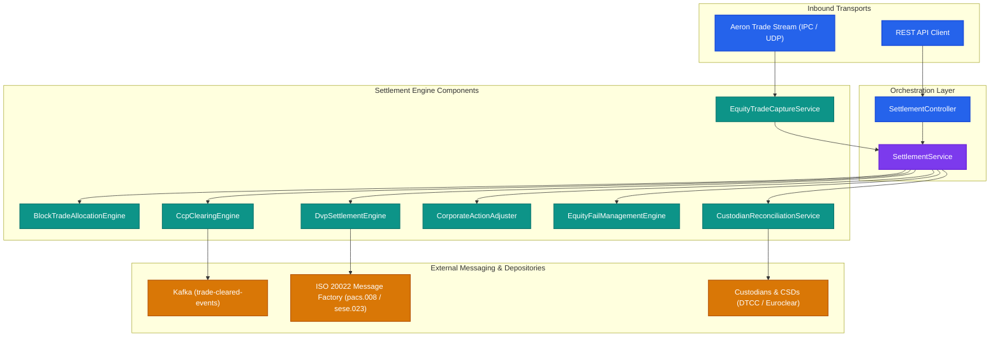
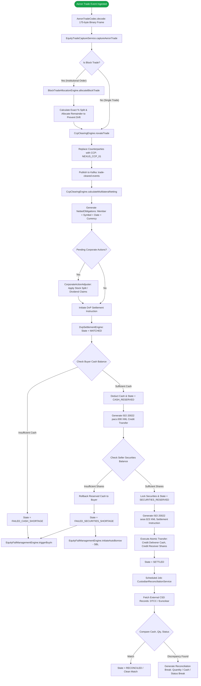
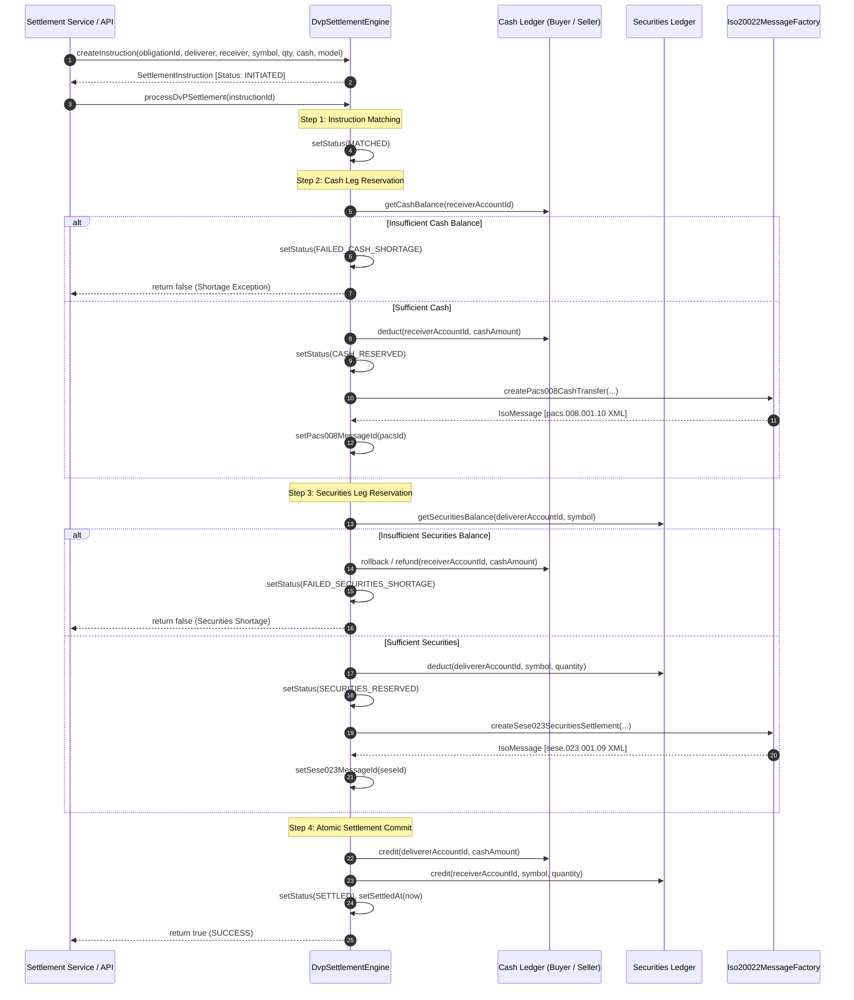
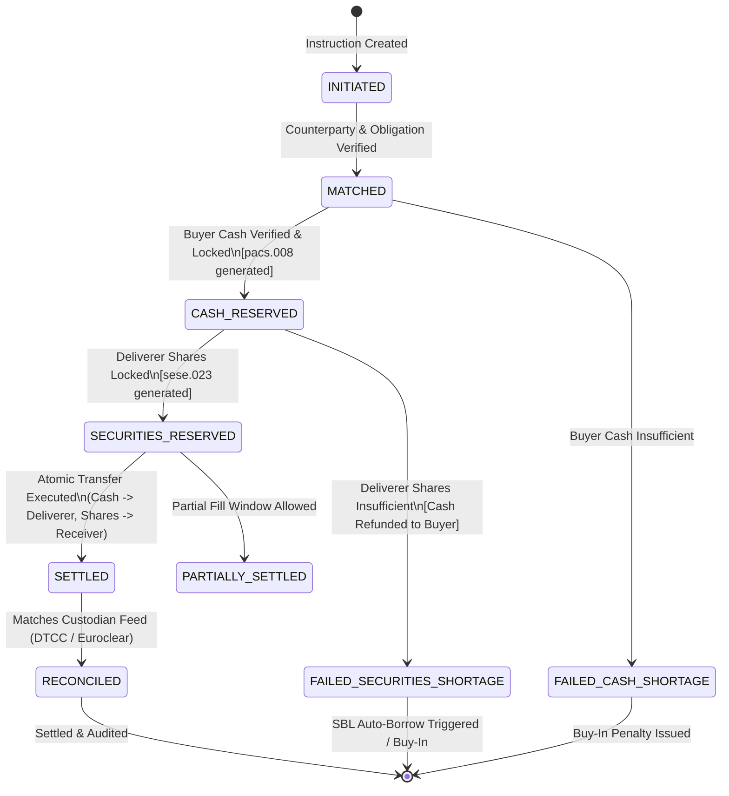

# Nexus-Trade: Settlement & Post-Trade Architecture Guide
**Target Audience:** Lead Developer / System Architect  
**Module Location:** [`src/main/java/com/trading/settlement`](file:///Users/nishi/Documents/GitHub/nexus-trade/src/main/java/com/trading/settlement)  
**Package:** `com.trading.settlement`

---

## 1. Executive Summary & Domain Scope

The **Settlement** module in `nexus-trade` implements an enterprise securities clearing, settlement, and asset servicing engine for institutional equities. It bridges ultra-low latency execution feeds with institutional settlement cycles (T+1 US standard and T+2 international standards), Delivery-versus-Payment (DvP) settlement models (BIS Models 1, 2, and 3), Central Counterparty (CCP) novation, corporate action adjustments, buy-in fail handling, and depository reconciliation.

```
   ┌──────────────────┐       ┌────────────────────────┐       ┌──────────────────────┐
   │ Execution Layer  │       │   Clearing House (CCP) │       │  CSD / Custodian     │
   │ (Aeron IPC / UDP)│ ────► │ (Novation & Netting)   │ ────► │ (DvP & Reconciliation│
   └──────────────────┘       └────────────────────────┘       └──────────────────────┘
```

### Core Sub-Domains:
1. **Low-Latency Ingestion (`aeron`)**: Zero-copy binary serialization of trades over Aeron IPC/UDP buffers.
2. **Trade Capture & Allocation (`allocation`)**: T+1 calendar enrichment and drift-free institutional block trade allocation.
3. **CCP Clearing & Multilateral Netting (`clearing`)**: Trade novation, multilateral portfolio netting, and Initial/Variation margin calculations.
4. **DvP Settlement Engine (`dvp`)**: Atomic 2-phase cash reservation and securities lock, with ISO 20022 XML generation (`pacs.008` and `sese.023`).
5. **Corporate Actions & Fail Management (`equities`)**: Dynamic trade adjustments (stock splits, dividend claims) and buy-in notices with SBL auto-borrowing.
6. **Depository Reconciliation (`reconciliation`)**: EOD 5-point break detection against DTCC / Euroclear custodian feeds.

---

## 2. Component Architecture Overview

The settlement module is organized into six functional domain sub-packages coordinated by [`SettlementService`](file:///Users/nishi/Documents/GitHub/nexus-trade/src/main/java/com/trading/settlement/SettlementService.java) and exposed via [`SettlementController`](file:///Users/nishi/Documents/GitHub/nexus-trade/src/main/java/com/trading/settlement/SettlementController.java).



---

## 3. End-to-End Trade Clearing & Settlement Flow

The following flowchart details the journey of an execution report from low-latency trade ingestion through CCP novation, netting, DvP settlement, exception routing, and EOD reconciliation.



---

## 4. Sequence Diagram: DvP Atomic Execution & ISO 20022 Dispatch

This sequence diagram details the two-phase lock and commit logic within [`DvpSettlementEngine`](file:///Users/nishi/Documents/GitHub/nexus-trade/src/main/java/com/trading/settlement/dvp/DvpSettlementEngine.java) and its generation of SWIFT / ISO 20022 messages.



---

## 5. Settlement Instruction State Machine

[`SettlementInstruction.Status`](file:///Users/nishi/Documents/GitHub/nexus-trade/src/main/java/com/trading/settlement/dvp/SettlementInstruction.java#L11-L21) governs the lifecycle of every delivery-versus-payment obligation:



### State Transitions Table

| From State | To State | Trigger Condition | Side Effects |
| :--- | :--- | :--- | :--- |
| `INITIATED` | `MATCHED` | Trade instruction validated | Counterparty details and symbol confirmed |
| `MATCHED` | `CASH_RESERVED` | Receiver has `balance >= cashAmount` | Receiver cash debited; `pacs.008` generated |
| `MATCHED` | `FAILED_CASH_SHORTAGE` | Receiver has `balance < cashAmount` | Settlement halted; triggers fail notification |
| `CASH_RESERVED` | `SECURITIES_RESERVED` | Deliverer has `shares >= quantity` | Deliverer shares debited; `sese.023` generated |
| `CASH_RESERVED` | `FAILED_SECURITIES_SHORTAGE` | Deliverer has `shares < quantity` | **Cash rolled back** to receiver; buy-in / SBL notice |
| `SECURITIES_RESERVED`| `SETTLED` | Atomic balance handoff | Deliverer cash credited; receiver shares credited |
| `SETTLED` | `RECONCILED` | EOD reconciliation match | Audit report logged clean |

---

## 6. Deep Dive into Sub-Packages & Technical Specifications

### 6.1 Aeron Zero-Copy Ingestion (`com.trading.settlement.aeron`)
- **Classes**: [`AeronTradeCodec`](file:///Users/nishi/Documents/GitHub/nexus-trade/src/main/java/com/trading/settlement/aeron/AeronTradeCodec.java), [`AeronTradeStreamPublisher`](file:///Users/nishi/Documents/GitHub/nexus-trade/src/main/java/com/trading/settlement/aeron/AeronTradeStreamPublisher.java), [`AeronTradeStreamSubscriber`](file:///Users/nishi/Documents/GitHub/nexus-trade/src/main/java/com/trading/settlement/aeron/AeronTradeStreamSubscriber.java)
- **Binary Wire Protocol**: Fixed 175-byte message structure encoded via Agrona `UnsafeBuffer` / `DirectBuffer`:
  ```
  [0..35]   tradeId        (36 bytes UTF-8)
  [36..71]  buyOrderId     (36 bytes UTF-8)
  [72..107] sellOrderId    (36 bytes UTF-8)
  [108..123] buyAccountId  (16 bytes UTF-8)
  [124..139] sellAccountId (16 bytes UTF-8)
  [140..147] symbol         (8 bytes UTF-8)
  [148..155] quantity       (int64)
  [156..163] price          (float64)
  [164..171] timestamp      (int64)
  [172..174] currency       (3 bytes UTF-8)
  Total: 175 bytes
  ```
- **Performance Characteristics**: Zero heap allocations on decode; sub-microsecond serialization over IPC / UDP.

---

### 6.2 Trade Capture & Block Allocation (`com.trading.settlement.allocation`)
- **Classes**: [`EquityTradeCaptureService`](file:///Users/nishi/Documents/GitHub/nexus-trade/src/main/java/com/trading/settlement/allocation/EquityTradeCaptureService.java), [`BlockTradeAllocationEngine`](file:///Users/nishi/Documents/GitHub/nexus-trade/src/main/java/com/trading/settlement/allocation/BlockTradeAllocationEngine.java), [`AllocationInstruction`](file:///Users/nishi/Documents/GitHub/nexus-trade/src/main/java/com/trading/settlement/allocation/AllocationInstruction.java)
- **Settlement Cycle Calculation**:
  - Automatically calculates settlement dates skipping weekend non-business days (Saturday and Sunday).
  - Default: **T+1** for US Equity Markets (SEC rule 15c6-1).
- **Rounding Drift Mitigation in Block Allocation**:
  - When allocating large institutional blocks (e.g. 100,000 shares across 3 funds at 33.33%, 33.33%, 33.34%), integer rounding can lose or gain shares.
  - The engine allocates:
    $$\text{quantity}_i = \text{round}\left(\text{totalQuantity} \times \frac{\text{pct}_i}{100}\right)$$
  - For the final fund $N$:
    $$\text{quantity}_N = \text{totalQuantity} - \sum_{i=1}^{N-1} \text{quantity}_i$$
  - Guarantees $100\%$ inventory conservation without fractional share drift.

---

### 6.3 CCP Clearing & Multilateral Netting (`com.trading.settlement.clearing`)
- **Classes**: [`CcpClearingEngine`](file:///Users/nishi/Documents/GitHub/nexus-trade/src/main/java/com/trading/settlement/clearing/CcpClearingEngine.java), [`ClearedTrade`](file:///Users/nishi/Documents/GitHub/nexus-trade/src/main/java/com/trading/settlement/clearing/ClearedTrade.java), [`NettedObligation`](file:///Users/nishi/Documents/GitHub/nexus-trade/src/main/java/com/trading/settlement/clearing/NettedObligation.java)
- **Trade Novation**:
  - Converts bilateral liability into multilateral obligations with `NEXUS_CCP_01` as central counterparty.
- **Multilateral Netting Algorithm**:
  - Groups cleared trades by compound key: `(clearingMemberId, symbol, settlementDate, currency)`.
  - Computes net positions:
    $$\text{netQuantity} = \sum \text{grossBuyQty} - \sum \text{grossSellQty}$$
    $$\text{netCashAmount} = \sum \text{grossBuyAmount} - \sum \text{grossSellAmount}$$
  - **Interpretation**:
    - $\text{netQuantity} > 0$: Clearing Member is net receiver of shares.
    - $\text{netQuantity} < 0$: Clearing Member is net deliverer of shares.
    - $\text{netCashAmount} > 0$: Clearing Member must pay cash.
    - $\text{netCashAmount} < 0$: Clearing Member receives cash.
- **Risk & Margin Calculation**:
  - $\text{Initial Margin (IM)} = \text{grossExposure} \times \text{initialMarginRate}$
  - $\text{Variation Margin (VM)} = \text{Uncollected Mark-to-Market losses across open trades}$
  - $\text{Total Margin} = \text{IM} + \text{VM}$

---

### 6.4 Delivery-versus-Payment & ISO 20022 (`com.trading.settlement.dvp`)
- **Classes**: [`DvpSettlementEngine`](file:///Users/nishi/Documents/GitHub/nexus-trade/src/main/java/com/trading/settlement/dvp/DvpSettlementEngine.java), [`SettlementInstruction`](file:///Users/nishi/Documents/GitHub/nexus-trade/src/main/java/com/trading/settlement/dvp/SettlementInstruction.java), [`DvPModel`](file:///Users/nishi/Documents/GitHub/nexus-trade/src/main/java/com/trading/settlement/dvp/DvPModel.java), [`Iso20022MessageFactory`](file:///Users/nishi/Documents/GitHub/nexus-trade/src/main/java/com/trading/settlement/dvp/Iso20022MessageFactory.java)
- **BIS Settlement Models Supported**:
  - `MODEL_1`: Continuous gross cash and gross securities settlement on a trade-by-trade basis.
  - `MODEL_2`: Gross securities settlement alongside net cash settlement.
  - `MODEL_3`: Net securities settlement alongside net cash settlement at end of clearing window.
- **ISO 20022 Payloads**:
  1. **Cash Leg (`pacs.008.001.10`)**: Financial Institution Customer Credit Transfer specifying debtor, creditor, end-to-end instruction ID, and interbank settlement amount.
  2. **Securities Leg (`sese.023.001.09`)**: Securities Settlement Transaction Instruction specifying ISIN/symbol, settlement quantity, delivery account, and receiving account.

---

### 6.5 Equities Asset Servicing & Fail Management (`com.trading.settlement.equities`)
- **Classes**: [`CorporateAction`](file:///Users/nishi/Documents/GitHub/nexus-trade/src/main/java/com/trading/settlement/equities/CorporateAction.java), [`CorporateActionAdjuster`](file:///Users/nishi/Documents/GitHub/nexus-trade/src/main/java/com/trading/settlement/equities/CorporateActionAdjuster.java), [`EquityFailManagementEngine`](file:///Users/nishi/Documents/GitHub/nexus-trade/src/main/java/com/trading/settlement/equities/EquityFailManagementEngine.java)
- **Corporate Action Adjustments (T to T+1 lifecycle)**:
  - **Stock Splits**: Adjusts pending instruction shares by split factor:
    $$\text{quantity}_{\text{adj}} = \text{round}\left(\text{quantity}_{\text{orig}} \times \frac{\text{numerator}}{\text{denominator}}\right)$$
    Total cash remains constant.
  - **Cash Dividends**: If settlement occurs on/after ex-date for a cum-dividend trade, dividend claim is appended:
    $$\text{cash}_{\text{adj}} = \text{cash}_{\text{orig}} + (\text{quantity} \times \text{dividendPerShare})$$
- **Fail Management & Buy-In**:
  - Initiates penalty buy-in:
    $$\text{penalty} = \text{marketPrice} \times \text{shortQty} \times \left(\frac{\text{penaltyPercent}}{100}\right)$$
    $$\text{totalCost} = (\text{marketPrice} \times \text{shortQty}) + \text{penalty}$$
  - Dispatches `SecuritiesBorrowRequest` (SBL) to cover delivery failure without halting settlement.

---

### 6.6 Depository Reconciliation (`com.trading.settlement.reconciliation`)
- **Classes**: [`CustodianReconciliationService`](file:///Users/nishi/Documents/GitHub/nexus-trade/src/main/java/com/trading/settlement/reconciliation/CustodianReconciliationService.java), [`CustodianRecord`](file:///Users/nishi/Documents/GitHub/nexus-trade/src/main/java/com/trading/settlement/reconciliation/CustodianRecord.java), [`ReconciliationReport`](file:///Users/nishi/Documents/GitHub/nexus-trade/src/main/java/com/trading/settlement/reconciliation/ReconciliationReport.java)
- **Break Detection Types**:
  1. `QUANTITY_MISMATCH`: Internal shares $\neq$ Custodian feed shares.
  2. `CASH_AMOUNT_MISMATCH`: Internal cash difference $> \$0.01$.
  3. `STATUS_MISMATCH`: Internal state (e.g. `SETTLED`) $\neq$ Custodian reported status.
  4. `MISSING_IN_INTERNAL_LEDGER`: Record exists at custodian but not tracked internally.
  5. `MISSING_IN_CUSTODIAN_FEED`: Internal instruction settled but missing from depository ledger.

---

## 7. REST API Reference

The [`SettlementController`](file:///Users/nishi/Documents/GitHub/nexus-trade/src/main/java/com/trading/settlement/SettlementController.java) exposes operational endpoints:

| Method | Path | Request Body | Description |
| :--- | :--- | :--- | :--- |
| `POST` | `/api/v1/settlement/trades/ingest` | `IngestTradeRequest` | Ingests execution into Aeron codec, captures trade, novates at CCP, and emits Kafka event |
| `POST` | `/api/v1/settlement/allocations/block` | `BlockAllocationRequest` | Allocates block trade across client accounts with zero drift |
| `POST` | `/api/v1/settlement/clearing/netting` | *None (Batch)* | Triggers multilateral netting across all novated trades |
| `POST` | `/api/v1/settlement/dvp/create` | `CreateDvpRequest` | Generates a new `SettlementInstruction` for DvP execution |
| `POST` | `/api/v1/settlement/dvp/process/{id}` | *Path Parameter* | Executes atomic DvP settlement, generates `pacs.008` & `sese.023` |
| `POST` | `/api/v1/settlement/reconciliation/run`| `List<CustodianRecord>`| Runs multi-point break reconciliation against external CSD records |

---

## 8. Architectural Recommendations for the Lead Developer

> [!IMPORTANT]
> **Priority 1: Ledger Persistence & ACID Guarantees**  
> Currently, [`DvpSettlementEngine`](file:///Users/nishi/Documents/GitHub/nexus-trade/src/main/java/com/trading/settlement/dvp/DvpSettlementEngine.java) stores cash and securities balances in memory (`ConcurrentHashMap`). For production:
> - Implement a double-entry persistence ledger backed by PostgreSQL / TigerBeetle / EventStore.
> - Ensure distributed transactions or optimistic concurrency checks across cash and securities reservations using a two-phase commit (2PC) or Saga orchestrator.

> [!TIP]
> **Priority 2: Aeron Polling Worker Thread**  
> In [`AeronTradeStreamSubscriber`](file:///Users/nishi/Documents/GitHub/nexus-trade/src/main/java/com/trading/settlement/aeron/AeronTradeStreamSubscriber.java), the `poll(int fragmentLimit)` method is called on-demand. Deploy an Agrona `AgentRunner` with a `BusySpinIdleStrategy` or `BackoffIdleStrategy` on a dedicated pinned CPU core to continuously drain Aeron publications into the `EquityTradeCaptureService`.

> [!NOTE]
> **Priority 3: Outbox Pattern for Kafka Events**  
> In [`SettlementService.java`](file:///Users/nishi/Documents/GitHub/nexus-trade/src/main/java/com/trading/settlement/SettlementService.java#L72-L74), `kafkaTemplate.send("trade-cleared-events", ...)` is invoked immediately after novation. Implement a transactional outbox pattern to guarantee at-least-once delivery if the broker experiences transient timeouts.

> [!TIP]
> **Priority 4: Real-time SWIFT / ISO 20022 Connectivity**  
> Connect the generated ISO 20022 XML payloads (`pacs.008` and `sese.023` from [`Iso20022MessageFactory`](file:///Users/nishi/Documents/GitHub/nexus-trade/src/main/java/com/trading/settlement/dvp/Iso20022MessageFactory.java)) to an MQ / SWIFT Alliance Gateway adapter for active clearing network delivery.
